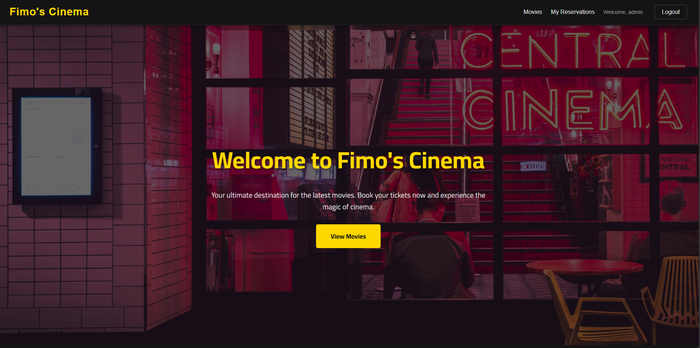

# Movie Frontend 🎬

This is a modern, standalone Angular application that provides a professional user interface for the Movie Reservation System. It features a clean, responsive design with a cinematic black and yellow theme, allowing users to browse movies, view details, and book seats in real-time.

This frontend consumes the **[Movie Reservation REST API (Spring Boot)](https://github.com/M-Sayed939/Movie-Reservation.git)**.

-----

### Preview

**Home Page**


**Movie List Page**


**Login Page**


**Registration Page**


-----

## Features ✨

- **Modern Standalone Architecture:** Built with Angular's latest standalone components, services, and guards for a clean and maintainable codebase.
- **Dynamic UI:** The interface, especially the navbar, reactively updates based on the user's authentication status using Angular Signals.
- **Professional Styling:** A custom-designed, responsive user interface with a cinematic black and yellow theme, smooth animations, and a focus on user experience.
- **Movie Browsing:** Users can view a grid of currently playing movies and click to see a detailed view with descriptions, genres, and showtimes.
- **Interactive Seat Reservation:** A visual seat map allows users to see which seats are available for a showtime and select the ones they wish to book.
- **Secure Route Guarding:** The booking page is protected by an authentication guard, automatically redirecting unauthenticated users to the login page.

## Technology Stack 🛠️

- **Framework:** Angular 17+
- **Language:** TypeScript
- **Styling:** CSS (with modern features like Flexbox and Grid)
- **State Management:** Angular Signals
- **HTTP Client:** Angular `HttpClient` for API communication
- **Build Tool:** Angular CLI

-----

## Getting Started 🚀

### Prerequisites

- **Node.js and npm**: Latest LTS version recommended.
- **Angular CLI**: `npm install -g @angular/cli`
- The **[Spring Boot Backend](https://github.com/M-Sayed939/Movie-Reservation.git)** must be running.

### 1\. Clone the Repository

```bash
git clone https://github.com/M-Sayed939/Movie-Reservation-FrontEnd.git
cd movie-reservation-frontend
```

### 2\. Install Dependencies

```bash
npm install
```

### 3\. Run the Development Server

This project is pre-configured with a proxy (`proxy.conf.json`) to avoid CORS issues. It will automatically forward API requests from `http://localhost:4200/api` to your backend at `http://localhost:8081/api`.

```bash
ng serve --open
```

The application will start, and your browser will open to `http://localhost:4200`.
